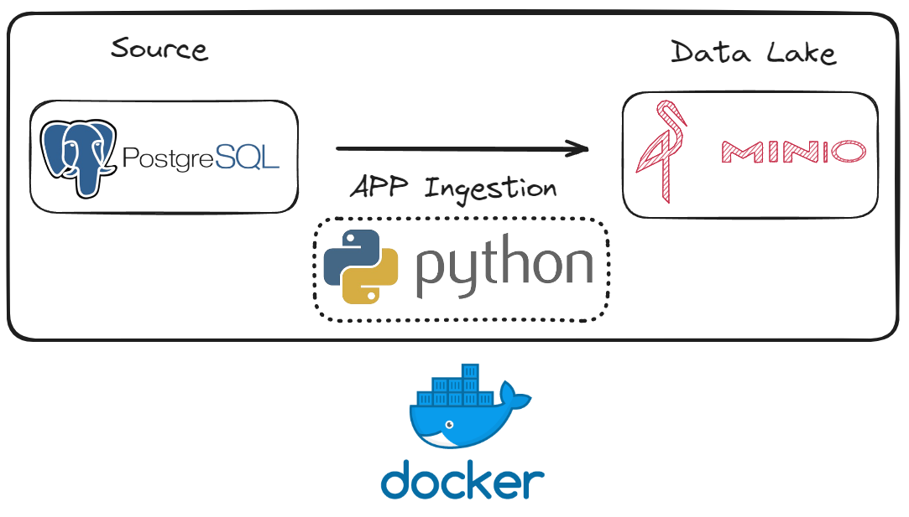

# Do Zero to Know What - Docker and Linux

## Estrutura do Projeto
```
├───app
│   ├───configs
│   ├───functions
│   ├───local_data
│   ├───plugins
├───docs
│   └───assets
├───minio
├───portainer
├───postgres
├───sql_server

```

| Pasta            | Descrição                                                                                       |
|------------------|-------------------------------------------------------------------------------------------------|
| `app`            | Diretório principal da aplicação, contém subpastas e arquivos essenciais para o funcionamento.  |
| `app/configs`    | Contém arquivos de configuração necessários para a aplicação.                                   |
| `app/functions`  | Diretório onde estão localizadas as funções principais da aplicação.                            |
| `app/local_data` | Contém dados locais utilizados pela aplicação.                                                  |
| `app/plugins`    | Contém plugins ou extensões que adicionam funcionalidades extras à aplicação.                   |
| `docs`           | Contém a documentação do projeto.                                                               |
| `docs/assets`    | Contém recursos como imagens e outros arquivos necessários para a documentação.                 |
| `minio`          | Diretório relacionado à configuração e dados do MinIO, um armazenamento de objetos compatível com S3. |
| `portainer`      | Diretório relacionado à configuração do Portainer, uma ferramenta de gerenciamento de contêineres. |
| `postgres`       | Diretório relacionado à configuração e dados do PostgreSQL, um sistema de gerenciamento de banco de dados. |
| `sql_server`     | Diretório relacionado à configuração e dados do SQL Server, outro sistema de gerenciamento de banco de dados. |


## Aplicação Python
Versão do Python 3.11.9



## Como Utilizar o Projeto?

### Primeiro passo: clone o repositório
```
git clone caminho do repo
```

### Segundo passo: acesse a pasta do projeto
```
cd caminho da pasta
```

## Crie e ative o ambiente virtual

### Criar ambiente virtual
```
python -m venv venv
```

### Ativar no Linux
```
source venv/bin/activate
```

### Ativar no Windows
```
.\venv\Scripts\activate
```

## Instalar pacotes necessários (Faça dentro do ambiente virtual)
```
pip install -r requirements
```

## Rodar o Portainer para gerenciar o Docker

### Step 1 - Acessar a pasta portainer
```
cd portainer
```

### Step 2
```
sudo docker compose up -d
```

## Portainer running sample


## Rodar o container do Postgres

### Step 1 - Acessar a pasta postgres
```
cd postgres
```

### Step 2
```
sudo docker compose up -d
```

## Rodar o container do Minio


### Step 1 - Acessar a pasta minio
```
cd minio
```

### Step 2
```
sudo docker compose up -d
```

## Developers
Wallace Camargo  

Luciano Borba

## Suport


