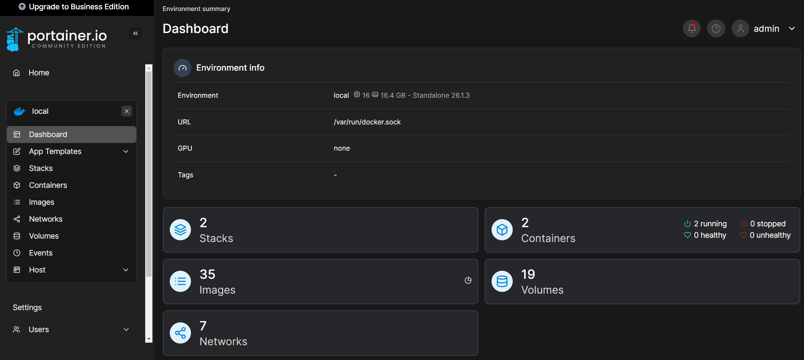

# Docker Tutorial

## Sobre
O Docker resolve o problema de isolamento das aplicações, garantindo que todas as aplicações vão funcionar em qualquer sistema operacional. Pelo fato de ele não necessitar de um sistema operacional, as aplicações irão funcionar de forma bem leve.

Simular a uma máquina virtual, onde cada container seria uma máquina rodando preferencialmente uma única aplicação. 

## Versões
- Docker Desktop para Windows
- Linux
- Mac
- Playground

## Portainer para gerenciar o Docker
Acessar a pasta portainer, baixar a imagem e executar o container.

### Step 1
```
cd portainer
```

### Step 2
```
sudo docker compose up -d
```

## Portainer running



| Componente | Descrição                              |
|------------|----------------------------------------|
| Stack      | Pacote utilizado                       |
| Images     | Imagens instaladas                     |
| Network    | Redes criadas para comunicação         |
| Containers | Serviços                               |
| Volumes    | Persistência dos dados                 |


## Docker no Terminal
### Listar container rodando
```
sudo docker ps
```

### Verificar imagens instaladas
```
sudo docker images
```

### Verificar volumes
```
sudo docker volume ls
```

### Verificar redes
```
sudo docker network ls
```

## Docker HUB

Repositório onde ficam as imagens. Muito similar ao Github, mas de containers.

### Pull da imagem (download)
```
docker pull nginx
```

### Rodar o container
```
docker run -d -p 80:80 nginx
```

### entrar no container
```
docker exec -it id /bin/bash
```

### Alterar arquivos dentro do container
```
cd /usr/share/nginx/html


echo "hello workshop" > index.html
```

### Construção de uma imagem

1 - Crie uma conta no Docker Hub 

2 - Antes do build, troque o ip do host para o ip da sua máquina no arquivo de configs, dentro da pasta ```configs/configs.py```

```
sudo docker build -t wlcamargo/app_python_workshop .

sudo docker login 

sudo docker push wlcamargo/app_python_workshop
```

### Rodar o container
```
docker run --rm --name app_python wlcamargo/app_python_workshop
```

### Rodar o container modo interativo
```
docker run -it -d --rm --name app_python wlcamargo/app_python_workshop /bin/bash
```

### Acessar o container
```
docker exec -it app_python /bin/bash
```